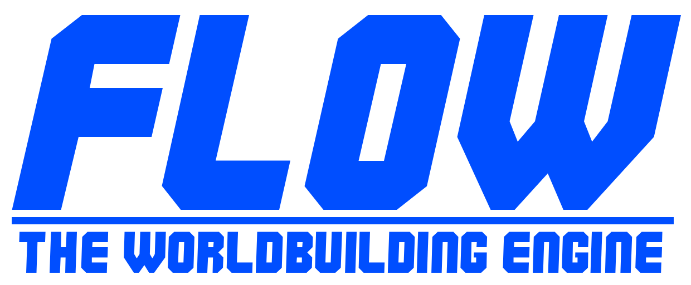

<p align="center">
  
</p>
---
##About
flowEngine is an open source (early in development) game engine. Currently it supports OpenGL, with infrustructure being built to support Vulkan (among other graphics APIs). It is being built and tested currently on Arch Linux, with Windows support planned in the future.
---
##Project Structure

<p align="center">
  
</p>
```
src/
  gfx/ (generic graphics structs, etc)
    ogl/ (opengl specific code)
    vlk/ (vulkan specific code)
  gui/ (imgui code)
  scene/ (game engine scene objects/logic)
  net/ (networking...)
  utils/ (generic utils used across all parts of engine)
  core/ (front facing app logic, window interaction, etc)
  events/ (engine wide event queue and processing, the switchboard of the engine)
```
